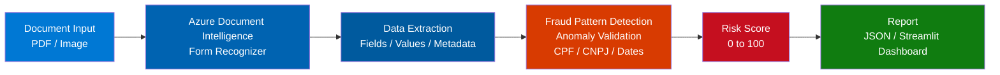

# Analise de Documentos Anti-fraude com Azure AI

## Descricao

Este projeto implementa uma solucao de analise automatizada de documentos utilizando Azure AI para identificar padroes de fraude, validar autenticidade e aumentar a seguranca de transacoes e processos empresariais, garantindo maior confiabilidade no processamento de documentos sensiveis.

## Arquitetura da Solucao



## Tecnologias Utilizadas

- **Python 3.10+**
- **Azure Document Intelligence** - Extracao de dados de documentos
- **Azure OpenAI Service** - Analise de padroes e avaliacao de risco
- **Azure Blob Storage** - Armazenamento de documentos
- **Streamlit** - Dashboard de analise

## Funcionalidades

1. **Extracao de dados** de documentos PDF e imagens usando Azure Document Intelligence
2. **Validacao de campos** - Verifica CPF, CNPJ, datas e valores
3. **Deteccao de anomalias** - Identifica inconsistencias nos documentos
4. **Analise de risco** - Azure OpenAI Service avalia padroes e riscos de fraude
5. **Dashboard interativo** - Visualizacao dos resultados em tempo real
6. **Pontuacao de risco** - Score de 0 a 100 para cada documento

## Estrutura do Projeto

```
analise-documentos-anti-fraude-azureai/
|-- src/
|   |-- document_analyzer.py   # Modulo de analise com Document Intelligence
|   |-- fraud_detector.py      # Motor de deteccao de fraude
|   |-- validators.py          # Validadores de campos
|   |-- azure_config.py        # Configuracao dos servicos Azure
|-- app.py                     # Dashboard Streamlit
|-- requirements.txt           # Dependencias
|-- .env.example               # Exemplo de variaveis de ambiente
|-- README.md
```

## Pre-requisitos

- Conta Azure com os seguintes servicos provisionados:
  - Azure Document Intelligence (Form Recognizer)
  - Azure OpenAI Service
  - Azure Blob Storage
- Python 3.10 ou superior

## Configuracao

1. Clone o repositorio:
```bash
git clone https://github.com/galafis/analise-documentos-anti-fraude-azureai.git
cd analise-documentos-anti-fraude-azureai
```

2. Instale as dependencias:
```bash
pip install -r requirements.txt
```

3. Configure as variaveis de ambiente:
```bash
cp .env.example .env
```

Edite o arquivo `.env`:
```
AZURE_DOCUMENT_INTELLIGENCE_KEY=sua_chave
AZURE_DOCUMENT_INTELLIGENCE_ENDPOINT=seu_endpoint
AZURE_OPENAI_KEY=sua_chave_openai
AZURE_OPENAI_ENDPOINT=seu_endpoint_openai
AZURE_OPENAI_DEPLOYMENT=nome_do_deployment
```

4. Execute a aplicacao:
```bash
streamlit run app.py
```

## Como Usar

1. Acesse o dashboard pelo navegador
2. Faca upload do documento (PDF ou imagem)
3. Aguarde a analise automatica
4. Visualize o relatorio com score de risco e detalhes da analise
5. Exporte o relatorio em JSON

## Projeto desenvolvido como parte do Microsoft Certification Challenge #4 - AI-102 na plataforma DIO.
